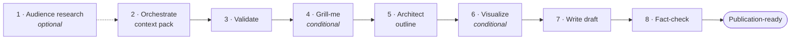

# Blog Writing Skill

> A source-backed **Agent Skills** bundle for technical and B2B article production — brainstorm, research, pressure-test, draft, fact-check, and review, all grounded in real evidence.

[](LICENSE)
[](#install)
[](#install)
[](#requirement-tavily)

Works for any technical or B2B domain — industrial equipment, software, manufacturing, materials science, logistics, finance, energy — as long as **you** supply the real industry context, audience, business goal, and source material. The skills never invent statistics, quotes, or citations.

---

## Table of Contents

- [Why this bundle](#why-this-bundle)
- [The pipeline](#the-pipeline)
- [Requirement: Tavily](#requirement-tavily)
- [Install](#install)
- [Updating](#updating)
- [Quick start](#quick-start)
- [Skill routing](#skill-routing)
- [The article workspace](#the-article-workspace)
- [Evidence model](#evidence-model)
- [Troubleshooting](#troubleshooting)
- [Maintaining this repo](#maintaining-this-repo)
- [License](#license)

---

## Why this bundle

Most "write me a blog" prompts hallucinate numbers and produce generic copy. This bundle is built around three hard rules:

- **Evidence first.** Every quantitative claim traces back to a validated *context pack*; unsupported claims are flagged, not shipped.
- **Real research, not guesswork.** Online research goes through [Tavily](#requirement-tavily) — never a silent fallback to generic web search.
- **Strategy before prose.** A Trellis-like workspace, a one-question-at-a-time pressure test, and a fact-check gate sit between the idea and the published article.

It ships **13 composable sub-skills** plus a single router that picks the right one from natural language.

## The pipeline

The `blog-writing-workflow` skill runs an 8-step pipeline. Required steps are solid; optional/conditional steps branch on the topic, the data, and what you ask for.



| Step | Skill | Status |
|---|---|---|
| 1 | `audience-pain-point-research` | optional — run for SEO / unfamiliar topics |
| 2 | `tech-blog-orchestrator` | **required** — builds the context pack |
| 3 | `data-validator` | **required** — quality gate before writing |
| 4 | `grill-me` | conditional — **mandatory when you ask to be grilled** |
| 5 | `tech-article-architect` | **required** — outline + section plan |
| 6 | `tech-visualization-generator` | conditional — only when data supports charts |
| 7 | `tech-blog-writer` | **required** — drafts from outline + context pack |
| 8 | `fact-checker` | **required** — numbers, units, logic, traceability |

> Prefer manual control? Invoke any sub-skill directly — see [Skill routing](#skill-routing).

## Requirement: Tavily

Online research is a **hard prerequisite**, not an enhancement. Research-dependent skills stop and ask for setup rather than falling back to generic web search. (Local file-only parsing runs without Tavily until the workflow needs online research or external claim verification.)

```bash
# 1. Add the Tavily skills
npx skills add https://github.com/tavily-ai/skills

# 2. Install the Tavily CLI
curl -fsSL https://cli.tavily.com/install.sh | bash   # or: uv tool install tavily-cli / pip install tavily-cli

# 3. Authenticate
tvly login --api-key tvly-YOUR_KEY                    # or: export TAVILY_API_KEY=tvly-YOUR_KEY

# 4. Verify
tvly --status
```

<details>
<summary>How research maps to Tavily skills</summary>

| Task | Tavily skill |
|---|---|
| Targeted source discovery | `tavily-search` |
| Clean extraction from known URLs | `tavily-extract` |
| Deeper multi-source reports | `tavily-research` |
| URL discovery on a known site | `tavily-map` |
| Bulk collection from a docs section | `tavily-crawl` |
| Implementation reference | `tavily-best-practices` |

Prefer authoritative sources (standards bodies, peer-reviewed papers, government/university research, manufacturer white papers, credible analyst reports). Avoid unsourced blogs, marketing brochures, and social-media claims.
</details>

## Install

Agent Skills follow an open standard, but installs **do not sync across products** — install separately for each agent you use.

| Agent | Method | Skill folder |
|---|---|---|
| Claude Code | standalone skill | `~/.claude/skills/blog-writing-skills/` |
| Claude Code | plugin marketplace | repo root via `.claude-plugin/` |
| Codex | standalone skill | `~/.codex/skills/blog-writing-skills/` |
| Codex | plugin bundle | repo root via `.codex-plugin/` |

```bash
git clone https://github.com/lizopower/Blog-Writing-Skill.git
```

<details>
<summary><b>Claude Code — standalone skill</b></summary>

```bash
mkdir -p ~/.claude/skills
cp -R Blog-Writing-Skill ~/.claude/skills/blog-writing-skills
```

```powershell
# Windows PowerShell
New-Item -ItemType Directory -Force "$HOME\.claude\skills"
Copy-Item -Recurse -Force ".\Blog-Writing-Skill" "$HOME\.claude\skills\blog-writing-skills"
```

Claude Code loads the root `SKILL.md` as the `blog-writing-skills` router. Restart or start a new session afterward. **Verify:** ask Claude Code *"Do you see the blog-writing-skills skill? Summarize its routing rules."*, then run `tvly --status`.
</details>

<details>
<summary><b>Claude Code — plugin</b></summary>

Plugin metadata lives in `.claude-plugin/plugin.json` and `.claude-plugin/marketplace.json`. Point your plugin marketplace at the repo root, then:

```bash
claude plugin validate <path-to-Blog-Writing-Skill>
```

Plugin skills are exposed with **namespacing** (`blog-writing-skills:<skill>`) rather than the bare skill name — see [Troubleshooting](#troubleshooting) if a router prompt does not trigger.
</details>

<details>
<summary><b>Codex — standalone skill</b></summary>

```bash
mkdir -p ~/.codex/skills
cp -R Blog-Writing-Skill ~/.codex/skills/blog-writing-skills
```

```powershell
# Windows PowerShell
New-Item -ItemType Directory -Force "$HOME\.codex\skills"
Copy-Item -Recurse -Force ".\Blog-Writing-Skill" "$HOME\.codex\skills\blog-writing-skills"
```

Or ask Codex: *"Use skill-installer to install https://github.com/lizopower/Blog-Writing-Skill into Codex."* Restart Codex / start a new thread afterward. **Verify** the same way as Claude Code, plus `tvly --status`.
</details>

<details>
<summary><b>Codex — plugin bundle</b></summary>

`.codex-plugin/plugin.json` identifies this repo as the `blog-writing-skills` plugin bundle. Codex plugin installs load skills from `./skills/`, so the repo ships `skills/blog-writing-skills/SKILL.md` as a Codex-facing router. Point your local plugin source at the repo root and reinstall/restart per your Codex plugin setup.
</details>

## Updating

Agent Skills are local copies — there is no auto-update. How you refresh depends on how you installed. **For the smoothest updates, install by cloning directly into your skills folder**, then a one-line `git pull` keeps you current:

```bash
# Recommended install that is trivial to update later
git clone https://github.com/lizopower/Blog-Writing-Skill.git ~/.codex/skills/blog-writing-skills    # Codex
git clone https://github.com/lizopower/Blog-Writing-Skill.git ~/.claude/skills/blog-writing-skills   # Claude Code
```

```bash
# Update anytime (a git-clone install)
git -C ~/.codex/skills/blog-writing-skills pull
git -C ~/.claude/skills/blog-writing-skills pull
```

If you installed by **copying** the folder (no `.git` inside), re-pull by deleting and re-cloning:

```bash
rm -rf ~/.codex/skills/blog-writing-skills
git clone https://github.com/lizopower/Blog-Writing-Skill.git ~/.codex/skills/blog-writing-skills
```

If you installed via **skill-installer**, just reinstall: *"Use skill-installer to reinstall https://github.com/lizopower/Blog-Writing-Skill."*

After any update, **restart the agent / start a new session** so the skill index is re-scanned. To be notified of new versions, **Watch → Releases** on GitHub; releases are tagged (e.g. `v2.2.0`) following [`VERSIONING.md`](VERSIONING.md).

## Quick start

Just describe what you want — the router selects the sub-skill. Examples (English and 中文 both work):

```text
帮我头脑风暴一篇关于工业视觉检测软件的文章方向，要像 Trellis 一样建工作区。
```
```text
Create a 2000-word technical article about warehouse automation ROI. Use Tavily research and fact-check all claims.
```
```text
Grill me on this article angle until the positioning is defensible — one question at a time.
```
```text
根据我提供的测试报告和 Excel 数据，写一篇关于新材料耐温性能的技术文章，需要图表建议和事实检查。
```
```text
I have a context_pack and outline. Write the final article, then fact-check it.
```

## Skill routing

The router in `SKILL.md` picks the **most specific** skill for the intent. When unclear, it asks one clarifying question instead of guessing.

| Intent | Skill |
|---|---|
| Vague idea, topic selection, content strategy, Trellis-like workspace | `blog-brainstorm` |
| Full article from topic/files to final draft | `blog-writing-workflow` |
| "Grill me", pressure-test, challenge, interrogate | `grill-me` |
| Source-backed technical/B2B research | `tech-research` |
| Audience pain, social listening, real search intent | `audience-pain-point-research` |
| Convert topic and/or files into a context pack | `tech-blog-orchestrator` |
| Extract data from PDF, Word, Excel, or tables | `tech-file-parser` |
| Validate context-pack completeness and quality | `data-validator` |
| Turn a context pack into an outline | `tech-article-architect` |
| Plan charts from structured data | `tech-visualization-generator` |
| Draft from outline + context pack | `tech-blog-writer` |
| Check facts, numbers, units, sources, logic | `fact-checker` |
| Judge whether content is compelling / publishable | `content-taste-advisor` |

<details>
<summary>How <code>blog-brainstorm</code> and <code>grill-me</code> behave</summary>

**`blog-brainstorm`** feels closer to Trellis than a one-shot prompt. It creates the full workspace up front, recommends a direction *before* asking you to decide, asks exactly one question at a time, updates `brief.md` + `article.json` after each answer, and converges on a confirmed brief. Decision order:

```text
business goal → audience → reader pain → angle → evidence → CTA → scope → success criteria
```

**`grill-me`** pressure-tests one branch at a time. It inspects existing files/workspace/context-pack/outline first, asks one question at a time *with its own recommended answer and rationale*, and ends with resolved decisions, open risks, and the next sub-skill. Decision tree:

```text
goal → audience → pain → angle → evidence → structure → claims → visuals → CTA → quality gate
```
</details>

## The article workspace

`blog-brainstorm` creates a Trellis-like workspace in your current project. `article.json` is the workflow-state file; never overwrite an existing workspace — read it and continue from its current phase.

```text
content/articles/<slug>/        # slug = lowercase kebab-case
├── article.json   # workflow state: id, title, status, phase, next action, goal, audience…
├── brief.md       # strategy: audience, pain, angle, CTA, success criteria
├── research/      # durable notes by topic/source cluster
├── sources.jsonl  # one source-inventory record per line
├── context_pack.json   # structured claims, data, glossary, risk notes
├── strategy.md    # pressure-test decisions, rejected angles, evidence gaps
├── outline.md     # structure + reader decision path
├── draft.md       # article body
├── fact_check.md  # numeric / unit / source / logic review
├── editorial_review.md  # taste, differentiation, SEO, CTA, publishability
└── finish.md      # final summary, reusable learnings, follow-up ideas
```

Lifecycle: `brainstorming → brief_confirmed → research_planning → context_building → strategy_pressure_test → outlining → drafting → fact_checking → editorial_review → completed`

```bash
# When the bundled scripts are available
python skills/blog-brainstorm/scripts/create_article_workspace.py "<Working Title>" --slug <slug> --root <project-root>
python skills/blog-brainstorm/scripts/validate_article_workspace.py <project-root>/content/articles/<slug>
```

## Evidence model

`context_pack.json` (contract **v2.1.0**) is the evidence object passed to the architect, writer, chart planner, and fact-checker. Minimum fields: `version`, `generated_at`, `topic`, `audience`, `key_claims`, `extracted_tables`, `glossary`, `risk_notes`, plus file/research source metadata.

Each key claim carries: claim text · source reference · source type · confidence level · units & test conditions (if numerical) · stated limitations.

```bash
# Validate before drafting
python skills/tech-blog-orchestrator/scripts/validate_context_pack.py <context_pack.json>
```

Schema: `schemas/context_pack_schema.json`. Always run `data-validator` before drafting.

## Troubleshooting

<details open>
<summary><b>Tavily is missing or unauthenticated</b></summary>

The agent stops before research and asks for setup. Fix:

```bash
npx skills add https://github.com/tavily-ai/skills
curl -fsSL https://cli.tavily.com/install.sh | bash
tvly login            # or: export TAVILY_API_KEY=tvly-YOUR_KEY
tvly --status
```
</details>

<details>
<summary><b>The agent wants to use generic web search</b></summary>

Stop it and remind: *"This bundle requires Tavily for online research. Do not use generic web search. Run Tavily preflight first."*
</details>

<details>
<summary><b>The article feels unsupported / has facts not in the context pack</b></summary>

Run `data-validator` on the context pack, then `grill-me` before outlining; if evidence is missing, return to `tech-research` or `audience-pain-point-research`. For a finished draft, run `fact-checker` against the draft + context pack and source or remove every unsupported claim.
</details>

<details>
<summary><b>A workspace already exists</b></summary>

Don't regenerate from scratch. Have the agent inspect `content/articles/<slug>/article.json`, `brief.md`, and `context_pack.json`, then continue from `article.json.currentPhase`.
</details>

<details>
<summary><b>A handoff between sub-skills does not resolve</b></summary>

When installed as a **plugin**, skills are namespaced as `blog-writing-skills:<skill-name>`; the routing docs use bare names for readability. As a **standalone** install, bare names work directly. If a bare name does not resolve, use the namespaced form, e.g. `blog-writing-skills:tech-blog-writer`.
</details>

## Maintaining this repo

Versioning is governed by [`VERSIONING.md`](VERSIONING.md): one release version across the three manifests; the Context Pack schema versions independently; no per-skill version lines. Run the checks before tagging a release:

```bash
python scripts/check_versions.py      # the 3 release manifests must agree
python scripts/check_router_sync.py   # both routers must cover every sub-skill
```

**Adding a sub-skill:** create `skills/<name>/SKILL.md`; add a routing entry to **both** routers — root `SKILL.md` (Claude Code) and `skills/blog-writing-skills/SKILL.md` (Codex), which are worded differently but must both cover every skill (enforced by `check_router_sync.py`); document direct usage here if needed; update standards/schemas if shared artifacts change.

**Changing research behavior:** update `standards/tavily_research_engine.md` and the affected skills, and keep the no-silent-fallback rule explicit.

## License

MIT — see [`LICENSE`](LICENSE).
