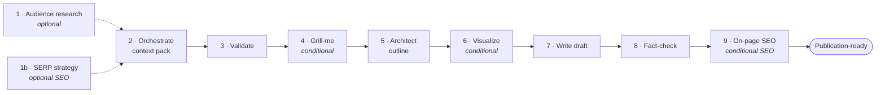

# Blog Writing Skill

> A source-backed **Agent Skills** bundle for technical and B2B article production: brainstorm article directions, build evidence packs, pressure-test strategy, draft from sources, fact-check claims, and finish on-page SEO.

[](LICENSE)
[](https://github.com/lizopower/Blog-Writing-Skill/releases)
[](#install)
[](#install)
[](#requirement-tavily)

Works for any technical or B2B domain — industrial equipment, software, manufacturing, materials science, logistics, finance, energy — as long as **you** supply the real industry context, audience, business goal, and source material. The skills are designed to flag missing evidence instead of inventing statistics, quotes, or citations.

## Agent Quick Install

```bash
# Claude Code preferred: native plugin install/update
claude plugin marketplace add lizopower/Blog-Writing-Skill
claude plugin install blog-writing-skills
claude plugin update blog-writing-skills
```

```bash
# Codex preferred: standalone skill install/update
curl -fsSL https://raw.githubusercontent.com/lizopower/Blog-Writing-Skill/main/scripts/install.sh | bash -s -- codex

# Claude Code plugin install/update through the same installer
curl -fsSL https://raw.githubusercontent.com/lizopower/Blog-Writing-Skill/main/scripts/install.sh | bash -s -- claude

# Codex standalone + Claude plugin
curl -fsSL https://raw.githubusercontent.com/lizopower/Blog-Writing-Skill/main/scripts/install.sh | bash -s -- all

# Claude Code standalone fallback only
curl -fsSL https://raw.githubusercontent.com/lizopower/Blog-Writing-Skill/main/scripts/install.sh | bash -s -- claude-standalone
```

```powershell
# Windows PowerShell installer
iwr https://raw.githubusercontent.com/lizopower/Blog-Writing-Skill/main/scripts/install.ps1 -OutFile install-blog-writing-skill.ps1
.\install-blog-writing-skill.ps1 codex
.\install-blog-writing-skill.ps1 claude
.\install-blog-writing-skill.ps1 claude-standalone
```

## At a Glance

| Need | Use |
|---|---|
| You have a vague article idea | `blog-brainstorm` creates a Trellis-like workspace and narrows the angle |
| You want a full article workflow | `blog-writing-workflow` runs research, validation, outline, draft, and fact-check gates |
| You need SEO strategy before writing | `seo-serp-strategist` adds SERP intent, keyword, and gap analysis |
| You have files or tables | `tech-file-parser` and `tech-blog-orchestrator` turn them into a context pack |
| You need final publish QA | `fact-checker` and `on-page-seo-finalizer` verify claims and page metadata |

Best fit: long-form technical content where source traceability matters. Not a fit: generic lifestyle posts, unsupported thought pieces, or requests where the agent is allowed to make up evidence.

---

## Table of Contents

- [Agent Quick Install](#agent-quick-install)
- [At a Glance](#at-a-glance)
- [Why this bundle](#why-this-bundle)
- [What you get](#what-you-get)
- [The pipeline](#the-pipeline)
- [Requirement: Tavily](#requirement-tavily)
- [Install](#install)
- [Updating](#updating)
- [One-command project init](#one-command-project-init)
- [Quick start](#quick-start)
- [Skill routing](#skill-routing)
- [The article workspace](#the-article-workspace)
- [Project writing specs](#project-writing-specs)
- [Optional session injection](#optional-session-injection)
- [Evidence model](#evidence-model)
- [Troubleshooting](#troubleshooting)
- [Maintaining this repo](#maintaining-this-repo)
- [License](#license)

---

## Why this bundle

Most "write me a blog" prompts hallucinate numbers and produce generic copy. This bundle is built around three hard rules:

- **Evidence first.** Every quantitative claim traces back to a validated *context pack*; unsupported claims are flagged, not shipped.
- **Real research, not guesswork.** Online research goes through [Tavily](#requirement-tavily) — never a silent fallback to generic web search.
- **Strategy before prose.** A Trellis-like workspace, a one-question-at-a-time pressure test, and a fact-check gate sit between the idea and the published article.

It ships **15 composable sub-skills** plus a single router that picks the right one from natural language.

## What you get

- A root router (`SKILL.md`) for Claude Code and a Codex-facing router (`skills/blog-writing-skills/SKILL.md`).
- A durable article workspace under `content/articles/<slug>/`, with phase state, brief, sources, context pack, outline, draft, reviews, and finish notes.
- Context Pack validation for claims, source metadata, extracted tables, glossary, risks, and optional SEO fields.
- Optional SessionStart context injection for Claude Code and Codex projects, so an agent can resume the current article without guessing.
- Maintenance checks for release-version alignment and router coverage.

## The pipeline

The `blog-writing-workflow` skill runs a core 8-step pipeline, plus two optional **English-first SEO layers** — `seo-serp-strategist` at the front and `on-page-seo-finalizer` at the end. Required steps are solid; optional/conditional steps branch on the topic, the data, and what you ask for.



| Step | Skill | Status |
|---|---|---|
| 1 | `audience-pain-point-research` | optional — social-platform user language |
| 1b | `seo-serp-strategist` | optional SEO front layer — SERP-grounded `seo_strategy` (English-first) |
| 2 | `tech-blog-orchestrator` | **required** — builds the context pack (carries `seo_strategy` through) |
| 3 | `data-validator` | **required** — quality gate before writing |
| 4 | `grill-me` | conditional — **mandatory when you ask to be grilled** |
| 5 | `tech-article-architect` | **required** — outline + section plan (consumes `search_intent`/gaps/PAA) |
| 6 | `tech-visualization-generator` | conditional — only when data supports charts |
| 7 | `tech-blog-writer` | **required** — drafts from outline + context pack |
| 8 | `fact-checker` | **required** — numbers, units, logic, traceability |
| 9 | `on-page-seo-finalizer` | conditional SEO back layer — final meta/slug/alt; writes `seo_finalization` |

> Prefer manual control? Invoke any sub-skill directly — see [Skill routing](#skill-routing).

## Requirement: Tavily

Online research is a **hard prerequisite**, not an enhancement. Research-dependent skills stop and ask for setup rather than falling back to generic web search. (Local file-only parsing runs without Tavily until the workflow needs online research or external claim verification.)

```bash
# 1. Add the Tavily skills
npx skills add https://github.com/tavily-ai/skills

# 2. Install the Tavily CLI
curl -fsSL https://cli.tavily.com/install.sh | bash   # or: uv tool install tavily-cli / pip install tavily-cli

# 3. Authenticate
tvly login --api-key tvly-YOUR_KEY                    # or: export TAVILY_API_KEY=tvly-YOUR_KEY

# 4. Verify
tvly --status
```

<details>
<summary>How research maps to Tavily skills</summary>

| Task | Tavily skill |
|---|---|
| Targeted source discovery | `tavily-search` |
| Clean extraction from known URLs | `tavily-extract` |
| Deeper multi-source reports | `tavily-research` |
| URL discovery on a known site | `tavily-map` |
| Bulk collection from a docs section | `tavily-crawl` |
| Implementation reference | `tavily-best-practices` |

Prefer authoritative sources (standards bodies, peer-reviewed papers, government/university research, manufacturer white papers, credible analyst reports). Avoid unsourced blogs, marketing brochures, and social-media claims.
</details>

## Install

Agent Skills follow an open standard, but installs **do not sync across products** — install this bundle separately for each agent you use.

For Claude Code, prefer the native plugin path. It lets Claude Code own plugin install/update state instead of making an agent inspect and edit skill directories:

```bash
claude plugin marketplace add lizopower/Blog-Writing-Skill
claude plugin install blog-writing-skills
claude plugin update blog-writing-skills
```

For Codex, or when you want a script to manage both hosts, use the installer. `claude` means Claude Code plugin install/update; `claude-standalone` is the filesystem fallback. For standalone folders, the installer automatically chooses between:

- fresh install,
- `git pull --ff-only` update of an existing git install,
- migration from an old copy-based install by moving it to `*.backup-<timestamp>` and cloning a fresh git checkout.

```bash
# Codex
curl -fsSL https://raw.githubusercontent.com/lizopower/Blog-Writing-Skill/main/scripts/install.sh | bash -s -- codex

# Claude Code plugin install/update
curl -fsSL https://raw.githubusercontent.com/lizopower/Blog-Writing-Skill/main/scripts/install.sh | bash -s -- claude

# Claude Code standalone fallback
curl -fsSL https://raw.githubusercontent.com/lizopower/Blog-Writing-Skill/main/scripts/install.sh | bash -s -- claude-standalone
```

On Windows PowerShell:

```powershell
iwr https://raw.githubusercontent.com/lizopower/Blog-Writing-Skill/main/scripts/install.ps1 -OutFile install-blog-writing-skill.ps1
.\install-blog-writing-skill.ps1 codex
.\install-blog-writing-skill.ps1 claude
.\install-blog-writing-skill.ps1 claude-standalone
```

Standalone/Codex installs also create `blog-writing` and `bws` command shims in `~/.local/bin` (`%USERPROFILE%\.local\bin` on Windows). If that directory is not on `PATH`, the installer prints a reminder.

If you keep this repository as an independent scaffold instead of a global agent skill, install only the command shims from the scaffold checkout:

```powershell
cd C:\Users\cuican\Blog-Writing-Skill
.\scripts\install.ps1 cli
```

Restart the agent or start a new session after install, then verify the bundle is visible and Tavily is authenticated.

| Agent | Method | Skill folder |
|---|---|---|
| Claude Code | plugin marketplace (preferred) | managed by Claude Code |
| Claude Code | standalone skill (fallback) | `~/.claude/skills/blog-writing-skills/` |
| Codex | standalone skill | `~/.codex/skills/blog-writing-skills/` |
| Codex | plugin bundle | repo root via `.codex-plugin/` |

<details>
<summary><b>Claude Code — standalone skill</b></summary>

Use this copy-based path only if you do not want the installed skill folder to be a git checkout:

```bash
git clone https://github.com/lizopower/Blog-Writing-Skill.git
mkdir -p ~/.claude/skills
cp -R Blog-Writing-Skill ~/.claude/skills/blog-writing-skills
```

```powershell
# Windows PowerShell
New-Item -ItemType Directory -Force "$HOME\.claude\skills"
Copy-Item -Recurse -Force ".\Blog-Writing-Skill" "$HOME\.claude\skills\blog-writing-skills"
```

Claude Code standalone installs load the root `SKILL.md` as the `blog-writing-skills` router. This is a fallback path: nested sub-skills under `skills/<name>/SKILL.md` are not guaranteed to be directly invokable through `blog-writing-skills:<sub-skill>` unless the bundle is installed as a Claude Code plugin. Restart or start a new session afterward. **Verify:** ask Claude Code *"Do you see the blog-writing-skills skill? Summarize its routing rules."*, then run `tvly --status`.
</details>

<details>
<summary><b>Claude Code — plugin</b></summary>

Plugin metadata lives in `.claude-plugin/plugin.json` and `.claude-plugin/marketplace.json`. Add this repository as a marketplace source, install the plugin, and update it through Claude Code:

```bash
claude plugin marketplace add lizopower/Blog-Writing-Skill
claude plugin install blog-writing-skills
claude plugin update blog-writing-skills
claude plugin validate <path-to-Blog-Writing-Skill>
```

Plugin skills are exposed with **namespacing** (`blog-writing-skills:<skill>`) rather than the bare skill name — see [Troubleshooting](#troubleshooting) if a router prompt does not trigger.
</details>

<details>
<summary><b>Codex — standalone skill</b></summary>

Use this copy-based path only if you do not want the installed skill folder to be a git checkout:

```bash
git clone https://github.com/lizopower/Blog-Writing-Skill.git
mkdir -p ~/.codex/skills
cp -R Blog-Writing-Skill ~/.codex/skills/blog-writing-skills
```

```powershell
# Windows PowerShell
New-Item -ItemType Directory -Force "$HOME\.codex\skills"
Copy-Item -Recurse -Force ".\Blog-Writing-Skill" "$HOME\.codex\skills\blog-writing-skills"
```

Or ask Codex: *"Use skill-installer to install https://github.com/lizopower/Blog-Writing-Skill into Codex."* Restart Codex / start a new thread afterward. **Verify** the same way as Claude Code, plus `tvly --status`.
</details>

<details>
<summary><b>Codex — plugin bundle</b></summary>

`.codex-plugin/plugin.json` identifies this repo as the `blog-writing-skills` plugin bundle. Codex plugin installs load skills from `./skills/`, so the repo ships `skills/blog-writing-skills/SKILL.md` as a Codex-facing router. Point your local plugin source at the repo root and reinstall/restart per your Codex plugin setup.
</details>

## Updating

Agent Skills are local copies unless installed through a native plugin manager. For Claude Code plugin installs, use:

```bash
claude plugin marketplace update
claude plugin update blog-writing-skills
```

For Codex and standalone installs, re-run the installer any time:

```bash
curl -fsSL https://raw.githubusercontent.com/lizopower/Blog-Writing-Skill/main/scripts/install.sh | bash -s -- codex
curl -fsSL https://raw.githubusercontent.com/lizopower/Blog-Writing-Skill/main/scripts/install.sh | bash -s -- claude
curl -fsSL https://raw.githubusercontent.com/lizopower/Blog-Writing-Skill/main/scripts/install.sh | bash -s -- claude-standalone
```

```powershell
iwr https://raw.githubusercontent.com/lizopower/Blog-Writing-Skill/main/scripts/install.ps1 -OutFile install-blog-writing-skill.ps1
.\install-blog-writing-skill.ps1 codex
.\install-blog-writing-skill.ps1 claude
.\install-blog-writing-skill.ps1 claude-standalone
```

If you installed by cloning directly and prefer manual updates:

```bash
git -C ~/.codex/skills/blog-writing-skills pull --ff-only
git -C ~/.claude/skills/blog-writing-skills pull --ff-only
```

If you installed via **skill-installer**, just reinstall: *"Use skill-installer to reinstall https://github.com/lizopower/Blog-Writing-Skill."*

Agents can read the current package version with `cat VERSION` / `Get-Content VERSION`. After any update, **restart the agent / start a new session** so the skill index is re-scanned. To be notified of new versions, **Watch → Releases** on GitHub; releases are tagged (e.g. `v3.5.1`) following [`VERSIONING.md`](VERSIONING.md).

## One-command project init

After installing the bundle into an agent, initialize each writing project once. This is the Blog-Writing-Skill equivalent of `trellis init`: the bundle is the global scaffold, while each project gets its own `.trellis-writing/` runtime plus project-local article/spec directories and optional session context injection.

If you installed with the standalone/Codex installer, or ran `scripts/install.ps1 cli` from an independent scaffold checkout, it also installs a `blog-writing` command plus the short alias `bws`:

```bash
cd <project-root>
blog-writing init

# Equivalent short form
bws init
```

Initialize another project without changing directories:

```bash
blog-writing init <project-root>
```

The lower-level script entry remains available when no shim is installed:

```bash
python skills/blog-brainstorm/scripts/init.py --root <project-root>
```

By default, init creates:

- `content/articles/`
- `content/specs/index.md`
- `.trellis-writing/runtime/scripts/`
- `.trellis-writing/.version`
- `.trellis-writing/.template-hashes.json`
- Claude Code SessionStart context injection in `.claude/settings.json`

Use Codex or both hosts:

```bash
blog-writing init --harness codex
blog-writing init --harness all
```

On Claude, a `PreToolUse` phase gate mechanically blocks writes to lifecycle artifacts before their phase. Codex has no `PreToolUse` hook, so the Codex install instead writes a managed lifecycle prelude into the project-root `AGENTS.md` (delimited by `<!-- BEGIN/END blog-writing-skill (managed) -->`). The block tells Codex agents to run `resume_context.py` first and to honor the same gates by convention. It is appended non-destructively — any user-authored `AGENTS.md` content is preserved — and `--uninstall` strips only the managed block.

Skip hook installation and only create project directories/spec store:

```bash
blog-writing init --no-session-hook
```

Hook installation prints a diff and asks for confirmation before writing host config. Add `--yes` only for trusted automation/tests.
Rerun the same init command after updating the bundle to refresh the managed hook block; existing host config outside the managed block is preserved.

Refresh the project-local runtime after updating the bundle:

```bash
blog-writing update
```

If update sees a user-modified managed runtime file, it keeps the original, writes a same-path `.new` file, and reports the conflict. It never updates `content/articles/` or `content/specs/`.

Uninstall managed hooks and runtime files without deleting writing content:

```bash
blog-writing uninstall
```

## Quick start

Just describe what you want — the router selects the sub-skill. Examples (English and 中文 both work):

```text
帮我头脑风暴一篇关于工业视觉检测软件的文章方向，要像 Trellis 一样建工作区。
```
```text
Create a 2000-word technical article about warehouse automation ROI. Use Tavily research and fact-check all claims.
```
```text
Grill me on this article angle until the positioning is defensible — one question at a time.
```
```text
根据我提供的测试报告和 Excel 数据，写一篇关于新材料耐温性能的技术文章，需要图表建议和事实检查。
```
```text
I have a context_pack and outline. Write the final article, then fact-check it.
```

## Skill routing

The router in `SKILL.md` picks the **most specific** skill for the intent. When unclear, it asks one clarifying question instead of guessing.

| Intent | Skill |
|---|---|
| Vague idea, topic selection, content strategy, Trellis-like workspace | `blog-brainstorm` |
| Full article from topic/files to final draft | `blog-writing-workflow` |
| "Grill me", pressure-test, challenge, interrogate | `grill-me` |
| Source-backed technical/B2B research | `tech-research` |
| Audience pain, social listening, real search intent | `audience-pain-point-research` |
| SERP analysis, keyword + search-intent strategy (`seo_strategy`) | `seo-serp-strategist` |
| Convert topic and/or files into a context pack | `tech-blog-orchestrator` |
| Extract data from PDF, Word, Excel, or tables | `tech-file-parser` |
| Validate context-pack completeness and quality | `data-validator` |
| Turn a context pack into an outline | `tech-article-architect` |
| Plan charts from structured data | `tech-visualization-generator` |
| Draft from outline + context pack | `tech-blog-writer` |
| Check facts, numbers, units, sources, logic | `fact-checker` |
| Final on-page SEO QA — meta, slug, alt, internal links, schema | `on-page-seo-finalizer` |
| Judge whether content is compelling / publishable | `content-taste-advisor` |

<details>
<summary>How <code>blog-brainstorm</code> and <code>grill-me</code> behave</summary>

**`blog-brainstorm`** feels closer to Trellis than a one-shot prompt. It creates the full workspace up front, recommends a direction *before* asking you to decide, asks exactly one question at a time, updates `brief.md` + `article.json` after each answer, and converges on a confirmed brief. Decision order:

```text
business goal → audience → reader pain → angle → evidence → CTA → scope → success criteria
```

**`grill-me`** pressure-tests one branch at a time. It inspects existing files/workspace/context-pack/outline first, asks one question at a time *with its own recommended answer and rationale*, and ends with resolved decisions, open risks, and the next sub-skill. Decision tree:

```text
goal → audience → pain → angle → evidence → structure → claims → visuals → CTA → quality gate
```
</details>

## The article workspace

`blog-brainstorm` creates a Trellis-like workspace in your current project. `article.json` is the workflow-state file; never overwrite an existing workspace — read it and continue from its current phase. Use `article.py` for lifecycle changes instead of editing `article.json.currentPhase` by hand.

```text
content/articles/<slug>/        # slug = lowercase kebab-case
├── article.json   # workflow state: id, title, status, phase, track, waivers, next action…
├── brief.md       # strategy: audience, pain, angle, CTA, success criteria
├── research/      # durable notes by topic/source cluster
├── sources.jsonl  # one source-inventory record per line
├── context_pack.json   # structured claims, data, glossary, risk notes
├── strategy.md    # pressure-test decisions, rejected angles, evidence gaps
├── outline.md     # structure + reader decision path
├── draft.md       # article body
├── fact_check.md  # numeric / unit / source / logic review
├── editorial_review.md  # taste, differentiation, SEO, CTA, publishability
└── finish.md      # final summary, reusable learnings, follow-up ideas
```

Lifecycle: `brainstorming → brief_confirmed → research_planning → context_building → strategy_pressure_test → outlining → drafting → fact_checking → editorial_review → completed`

```bash
# When the bundled scripts are available
python skills/blog-brainstorm/scripts/article.py create "<Working Title>" --slug <slug> --root <project-root>
python skills/blog-brainstorm/scripts/validate_article_workspace.py <project-root>/content/articles/<slug>
```

Lifecycle commands:

```bash
python skills/blog-brainstorm/scripts/article.py status --slug <slug> --root <project-root>
python skills/blog-brainstorm/scripts/article.py advance --to outlining --slug <slug> --root <project-root>
python skills/blog-brainstorm/scripts/article.py finish --slug <slug> --root <project-root>
python skills/blog-brainstorm/scripts/article.py archive --slug <slug> --root <project-root>
```

Tracks:

- `full` is the default track and enforces the complete phase chain.
- `lightweight` may skip the outlining gate by advancing from `strategy_pressure_test` to `drafting`.
- Both tracks still require fact-check evidence before completion.

If a gate blocks a legitimate migration or emergency handoff, use an explicit audited waiver:

```bash
python skills/blog-brainstorm/scripts/article.py advance --to <phase> --slug <slug> --root <project-root> --waive "<reason>"
```

Waivers are written to `article.json.waivers[]`; use them sparingly and never as a silent shortcut.

## Project writing specs

Reusable learnings from finished articles live in the user's project, not in this bundle:

```text
content/specs/
├── index.md
└── <slug>.md
```

Use `spec.py` to manage this project-local spec store:

```bash
python skills/blog-brainstorm/scripts/spec.py init --root <project-root>
python skills/blog-brainstorm/scripts/spec.py add --title "Numeric formatting" --root <project-root>
python skills/blog-brainstorm/scripts/spec.py list --root <project-root>
python skills/blog-brainstorm/scripts/spec.py show numeric-formatting --root <project-root>
```

At finish, review `finish.md` → `Standards Update Candidates`; accepted project rules should be added with `spec.py add`. The bundle `standards/` directory remains read-only reference material.

## Optional session injection

The bundle has three layers:

- Portable context: `resume_context.py` prints the current article target, phase, track, next allowed phases, blocked gate reasons, and project specs. You can run it manually in any project.
- Project runtime: `init.py` installs `.trellis-writing/runtime/scripts/` into each writing project, so hooks do not depend on a global bundle path.
- Host integration: `install_session_hook.py` installs a SessionStart hook for Claude Code or Codex so new sessions receive that context automatically. Both hosts receive the context as a structured SessionStart envelope (`hookSpecificOutput.additionalContext`); `--harness` only selects the install location and timeout. Re-run the installer after updating the bundle so existing hooks pick up the current format.

Manual context check:

```bash
python skills/blog-brainstorm/scripts/resume_context.py --root <project-root>
python skills/blog-brainstorm/scripts/resume_context.py --root <project-root> --slug <article-slug>
```

When several articles are in progress, the output begins with `Current Target: <slug>` and lists the other active articles plus the switch command. This is intentional: it keeps the agent from writing into the wrong article workspace.

For normal setup, prefer the unified init command:

```bash
python skills/blog-brainstorm/scripts/init.py --root <project-root> --harness claude
python skills/blog-brainstorm/scripts/init.py --root <project-root> --harness codex
```

Install only the optional hook:

```bash
python skills/blog-brainstorm/scripts/install_session_hook.py --harness claude --install --root <project-root>
python skills/blog-brainstorm/scripts/install_session_hook.py --harness codex --install --root <project-root>
```

The installer prints a diff with the reason for the change and asks for confirmation before writing. It only adds managed SessionStart entries to the host config:

- Claude Code: `<project-root>/.claude/settings.json`
- Codex: `<project-root>/.codex/hooks.json`

Rerunning the installer is idempotent and refreshes only the managed entries, which is useful after updating the bundle.
For full runtime refresh or uninstall, prefer `init.py --update` / `init.py --uninstall`; direct installer uninstall only removes hook entries.

Uninstall:

```bash
python skills/blog-brainstorm/scripts/install_session_hook.py --harness claude --uninstall --root <project-root>
python skills/blog-brainstorm/scripts/install_session_hook.py --harness codex --uninstall --root <project-root>
```

Both hosts may ask you to trust the hook the first time it runs. Review the command and approve it through the host's normal trust flow. Do not bypass hook trust.

## Evidence model

`context_pack.json` (contract **v2.3.0**) is the evidence object passed to the architect, writer, chart planner, and fact-checker. Minimum fields: `version`, `generated_at`, `topic`, `audience`, `key_claims`, `extracted_tables`, `glossary`, `risk_notes`, plus file/research source metadata. The optional `seo_strategy` object (SERP-grounded keywords, search intent, competitor gaps, advisory on-page seeds) and the optional top-level `seo_finalization` object (final meta/slug/alt) were added in v2.3.0; packs without them stay fully backward compatible.

Each key claim carries: claim text · source reference · source type · confidence level · units & test conditions (if numerical) · stated limitations.

```bash
# Validate before drafting
python skills/tech-blog-orchestrator/scripts/validate_context_pack.py <context_pack.json>
```

Schema: `schemas/context_pack_schema.json`. Always run `data-validator` before drafting.

## Troubleshooting

<details open>
<summary><b>Tavily is missing or unauthenticated</b></summary>

The agent stops before research and asks for setup. Fix:

```bash
npx skills add https://github.com/tavily-ai/skills
curl -fsSL https://cli.tavily.com/install.sh | bash
tvly login            # or: export TAVILY_API_KEY=tvly-YOUR_KEY
tvly --status
```
</details>

<details>
<summary><b>The agent wants to use generic web search</b></summary>

Stop it and remind: *"This bundle requires Tavily for online research. Do not use generic web search. Run Tavily preflight first."*
</details>

<details>
<summary><b>Tavily works, but Windows terminal output crashes with Unicode</b></summary>

This is usually a terminal encoding issue, not a Tavily API failure. On Windows terminals using GBK, `tvly search --json` can fail when JSON contains Unicode characters such as bullets or long dashes. Write output to a file instead of stdout:

```powershell
tvly search "your query" --json -o tavily-search.json
```

For extraction, use the current Tavily CLI raw-content option rather than an invented markdown flag:

```powershell
tvly extract https://example.com --include-raw-content -o tavily-extract.json
```
</details>

<details>
<summary><b>The article feels unsupported / has facts not in the context pack</b></summary>

Run `data-validator` on the context pack, then `grill-me` before outlining; if evidence is missing, return to `tech-research` or `audience-pain-point-research`. For a finished draft, run `fact-checker` against the draft + context pack and source or remove every unsupported claim.
</details>

<details>
<summary><b>A workspace already exists</b></summary>

Don't regenerate from scratch. Have the agent inspect `content/articles/<slug>/article.json`, `brief.md`, and `context_pack.json`, then continue from `article.json.currentPhase`.
</details>

<details>
<summary><b>A handoff between sub-skills does not resolve</b></summary>

Claude Code has two install modes with different skill resolution behavior:

- **Plugin install:** sub-skills are namespaced as `blog-writing-skills:<skill-name>` and should resolve through the plugin system, e.g. `blog-writing-skills:tech-blog-orchestrator`.
- **Standalone install:** Claude Code loads the root `blog-writing-skills` router from `~/.claude/skills/blog-writing-skills/SKILL.md`. Nested sub-skills under this repo's `skills/` directory may not be directly invokable as namespaced skills unless the plugin is installed.

If an agent says only "Invoke the skill" and does not inject the selected sub-skill instructions, check whether the plugin is installed:

```bash
claude plugin list --json --available
claude plugin install blog-writing-skills
```

For full article requests, the root router should route to `blog-writing-workflow`; direct sub-skill calls are safest after a plugin install.
</details>

## Maintaining this repo

Versioning is governed by [`VERSIONING.md`](VERSIONING.md): one release version across `VERSION` and the three manifests; the Context Pack schema versions independently; no per-skill version lines. Run the checks before tagging a release:

```bash
python scripts/check_versions.py      # release version files must agree
python scripts/check_router_sync.py   # both routers must cover every sub-skill
```

**Adding a sub-skill:** create `skills/<name>/SKILL.md`; add a routing entry to **both** routers — root `SKILL.md` (Claude Code) and `skills/blog-writing-skills/SKILL.md` (Codex), which are worded differently but must both cover every skill (enforced by `check_router_sync.py`); document direct usage here if needed; update standards/schemas if shared artifacts change.

**Changing research behavior:** update `standards/tavily_research_engine.md` and the affected skills, and keep the no-silent-fallback rule explicit.

## License

GNU Affero General Public License v3.0 (**AGPL-3.0-only**) — see [`LICENSE`](LICENSE).

```
Blog-Writing-Skill
Copyright (C) 2026 lizopower

This program is free software: you can redistribute it and/or modify it under
the terms of the GNU Affero General Public License, version 3, as published by
the Free Software Foundation.

This program is distributed in the hope that it will be useful, but WITHOUT ANY
WARRANTY; without even the implied warranty of MERCHANTABILITY or FITNESS FOR A
PARTICULAR PURPOSE. See the GNU Affero General Public License for more details.
```

This bundle's article workflow builds on concepts from
[Trellis](https://github.com/mindfold-ai/Trellis) (AGPL-3.0). To stay aligned
with that project's copyleft terms, the bundle is distributed under AGPL-3.0 as
well. Note the AGPL network clause: if you run a modified version of this
software as a network service, you must offer its users the corresponding source.

## Acknowledgements

The brainstorm-to-workspace lifecycle, the phase gates, and the project-local
writing-spec store are inspired by [Trellis](https://github.com/mindfold-ai/Trellis),
an AGPL-3.0 AI development workflow framework. With thanks to the Trellis authors
for the workflow ideas that shaped this design.
