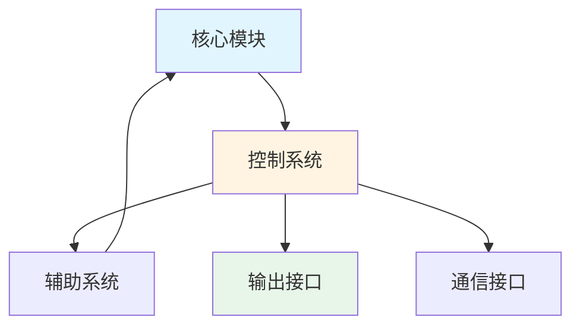

# Tech Visualization Generator Skill - README

## 概述

**Tech Visualization Generator** 是一个专业的数据可视化生成 Skill，专为技术博客内容定制。它将结构化数据转化为可嵌入的图表/图形，严格遵守数据治理原则，不推断、不补数、不外推。

## 角色定位

- **角色**: 数据可视化生成器
- **职责**: 把结构化数据变成图表/图形
- **输出**: Chart Manifests + Mermaid/绘图指令
- **特色**: 零容忍数据编造 + 完整可追溯性

## 核心能力

### 1. 结构化数据转图表
- 接收 Parser/Research 输出或完整 Context Pack
- 生成可嵌入技术博客的图表
- 支持多种图表类型

### 2. 严格数据治理
- ❌ 严禁补数、外推、估算
- ✅ 只使用明确提供的数值
- ✅ 缺失字段必须声明
- ✅ 数据冲突必须报错

### 3. 完整可追溯性
- 每个图表必须有来源定位（页码/Sheet/章节）
- 每个数据点必须有 JSON 路径
- 不得使用"行业典型"等泛化来源

### 4. 多语言支持
- 中文/英文自适应
- 中文字体正确处理（避免乱码）
- 标题、坐标轴、图例多语言

### 5. 响应式嵌入
- 建议嵌入尺寸和长宽比
- 文字密度管理（类别过多自动调整）
- 完整 alt 文本和 caption（SEO + 可访问性）

## 不做什么

- ❌ 不写文章正文
- ❌ 不做研究或推断
- ❌ 不补充缺失数据
- ❌ 不外推或估算
- ❌ 不做 SEO 优化（仅提供 alt/caption）

## 输入输出

### 输入

**必需**:
```
dataset_json: 结构化数据（Parser/Research 输出或 Context Pack）
```

**可选**:
```
chart_requests: 指定图表需求（为空则自动选择3-6个图）
lang: 语言偏好（zh/en，默认跟随数据语言）
```

### 输出

```json
{
  "charts_manifest": {
    "total_charts": 5,
    "language": "zh",
    "charts": [
      {
        "chart_id": "chart_01",
        "type": "line_chart",
        "title": "[性能指标]保持率 vs. [条件变量]",
        "data_paths": ["context_pack.extracted_tables[0].data"],
        "source_ref": "test_report.pdf:Page 12, Table 3",
        "metric": "[Performance Metric] Retention",
        "unit": "%",
        "caption": "展示[性能指标]保持率随[条件变量]变化",
        "alt": "折线图显示[性能指标]保持率vs[条件变量]，[极限条件]时为[X]%",
        ...
      }
    ]
  },
  
  "chart_bodies": [
    {
      "chart_id": "chart_01",
      "format": "drawing_instructions",
      "content": {...}
    }
  ],
  
  "quality_report": {
    "total_charts_generated": 5,
    "charts_skipped": 1,
    "data_gaps_found": 2,
    "errors": 0
  }
}
```

## 支持的图表类型

### 1. 对比表（Comparison Table）
- **格式**: Markdown 表格
- **适用**: 多维度对比、复杂数据
- **示例**: [我方方案] vs. 传统[替代方案]规格对比

### 2. 折线图（Line Chart）
- **适用**: 时间序列、连续变量趋势
- **示例**: [性能指标] vs. [条件变量]、[输出指标] vs. 时间

### 3. 柱状图（Bar Chart）
- **适用**: 类别对比、离散数据
- **示例**: 不同[部署场景类型]的[资源消耗]对比

### 4. 饼图（Pie Chart）
- **适用**: 占比数据（仅当总和=100%或可验证）
- **示例**: TCO 细分（仅当所有组成部分都提供）

### 5. 流程图（Flowchart）
- **格式**: Mermaid flowchart
- **适用**: 流程步骤、系统架构
- **示例**: [产品/系统]架构图

### 6. 时间轴（Timeline）
- **格式**: Mermaid timeline 或 Markdown 表格
- **适用**: 项目里程碑、发展历程
- **示例**: 部署时间线

## 数据提取规则

### 当 dataset_json = context_pack 时

**✅ 允许使用**:
1. `context_pack.extracted_tables` （首选）
2. `context_pack.key_claims` （仅当包含可结构化数值）

**❌ 严禁使用**:
- `glossary` （仅参考，不提取数据）
- `risk_notes` （仅参考）
- 任何推导或补全

### 必需字段验证

生成任何图表前，必须验证以下字段存在：
- **单位**: 所有数值必须有单位
- **时间轴**: 时间序列需要日期/时间戳
- **分组维度**: 对比需要类别
- **样本口径**: 样本量、测试条件
- **范围**: 最小/最大值、误差范围
- **测试条件**: 温度、电流、时长等

**缺失任何字段**:
1. 输出 `data_gaps` 列表
2. 降级为对比表
3. 或跳过该图

## 数据冲突检测

如果发现以下冲突，输出 `chart_error` 并停止生成：
- 同一指标不同单位
- 同一指标不同口径
- 重复口径
- 互斥条件混用

**示例**:
```json
{
  "chart_error": "Unit conflict for Capacity: Ah vs. %",
  "action": "Chart generation stopped"
}
```

## 使用场景

### 场景 1: Context Pack 输入（最常见）

**输入**:
```json
{
  "extracted_tables": [
    {
      "table_id": "table_1",
      "source": "test_report.pdf:Page 12, Table 3",
      "columns": [
        {"name": "Temperature", "unit": "°C"},
        {"name": "Capacity", "unit": "Ah"}
      ],
      "data": [
        {"Temperature": -40, "Capacity": 87}
      ]
    }
  ]
}
```

**输出**:
- chart_01: 折线图（容量 vs. 温度）
- source_ref: "test_report.pdf:Page 12, Table 3"

### 场景 2: 指定图表需求

**输入**:
```json
{
  "dataset_json": {...},
  "chart_requests": [
    "Line chart: Capacity vs. Temperature",
    "Comparison table: [Our solution] vs. [Traditional approach]"
  ]
}
```

**输出**:
- 按需生成指定图表
- 验证数据可用性

### 场景 3: 自动选择图表

**输入**:
```json
{
  "dataset_json": {...},
  "chart_requests": null
}
```

**行为**:
- 自动选择 3-6 个最有信息增益的图表
- 优先级：关键发现 → 时间序列 → 对比 → 性能曲线

### 场景 4: 缺失数据处理

**输入**:
```json
{
  "columns": [{"name": "Temperature"}, {"name": "Capacity"}],
  "data": [{"Temperature": -40, "Capacity": 87}]
}
```

**输出**:
```json
{
  "chart_error": "Missing units for Temperature and Capacity",
  "data_gaps": ["unit:Temperature", "unit:Capacity"],
  "action": "Chart skipped"
}
```

## Chart Manifest 规范

### 必需字段

```json
{
  "chart_id": "chart_01",           // 唯一 ID（两位数递增）
  "type": "line_chart",             // 图表类型
  "title": "容量保持率 vs. 温度",    // 描述性标题
  
  "data_paths": [                   // JSON 路径到源数据
    "context_pack.extracted_tables[0].data"
  ],
  
  "source_ref": "test_report.pdf:Page 12, Table 3",  // 可追溯来源
  
  "metric": "Capacity Retention",   // 主要指标
  "unit": "%",                      // 单位
  
  "grouping": "Temperature (°C)",   // 分组/类别维度
  "filters": "0.2C discharge rate", // 筛选条件
  
  "assumptions": "",                // 假设（可为空）
  "limitations": "Lab conditions",  // 限制
  
  "recommended_size": {             // 建议嵌入尺寸
    "width": "800px",
    "aspect_ratio": "16:9"
  },
  
  "caption": "展示[性能指标]保持率...",  // SEO caption
  "alt": "折线图显示...",            // 可访问性 alt
  
  "data_gaps": [],                  // 缺失字段（可为空）
  "chart_error": null               // 错误信息（null=正常）
}
```

## 中文支持

### 字体处理

**对于 PNG/SVG 输出**:
```json
{
  "font": {
    "family": "Noto Sans CJK SC, Source Han Sans CN, Microsoft YaHei, sans-serif",
    "fallback": "sans-serif"
  }
}
```

### 中文文本

**标题、坐标轴、图例**:
```json
{
  "title": "[性能指标]保持率 vs. [条件变量]范围",
  "x_axis": {"label": "[条件变量] ([单位])"},
  "y_axis": {"label": "[性能指标]保持率 (%)"},
  "caption": "展示[产品/技术]在[条件下限]至[条件上限]范围内的[性能指标]保持率变化趋势",
  "alt": "折线图显示[性能指标]保持率（%）与[条件变量]（[单位]）关系"
}
```

## 响应式嵌入

### 尺寸建议

```json
{
  "recommended_size": {
    "width": "100%",        // 或 "800px" / "640px"
    "aspect_ratio": "16:9", // 或 "4:3" / "1:1"
    "responsive": "scale_down_mobile"
  }
}
```

### 文字密度管理

**类别过多时**:
- ✅ 自动旋转为横向柱状图
- ✅ 使用 Top-N + "其他" 分组
- ✅ 拆分为多个小图
- ✅ 在 manifest 中记录策略和阈值

## 质量控制

### 输出前检查

- [ ] 所有 chart_ids 顺序（chart_01, chart_02, ...）
- [ ] 所有必需字段存在
- [ ] 所有 data_paths 可追溯到 dataset_json
- [ ] 所有 source_refs 有效且具体
- [ ] 所有指标有单位
- [ ] 无编造或外推数据
- [ ] data_gaps 已记录
- [ ] chart_error 已处理
- [ ] alt/caption 完整
- [ ] 中文字体正确（如适用）
- [ ] JSON 格式有效

### 输出验证

**验证脚本**（伪代码）:
```python
for chart in charts_manifest:
    assert chart.chart_id.matches("chart_\d{2}")
    assert all_traceable(chart.data_paths, dataset_json)
    assert chart.source_ref not empty
    assert chart.unit not empty (if numeric)
    assert chart.alt and chart.caption not empty
    if chart.data_gaps:
        assert chart.type in ["comparison_table"] or skipped
    if chart.chart_error:
        assert chart not generated
```

## 与 Orchestrator 集成

### 完整工作流

```
1. Orchestrator 调用 Research + Parser（并行）
2. Orchestrator 组装 Context Pack
3. 用户/Orchestrator 调用 Visualization Generator
4. Generator 接收 Context Pack 作为 dataset_json
5. Generator 输出 charts_manifest + chart_bodies
6. 用户将图表嵌入文章
```

### Context Pack 兼容性

**保证兼容的字段**:
- `extracted_tables` → 主要数据源
- `key_claims` → 次要验证/标注
- `visualization_recommendations` → 提示（非强制）

**不使用**:
- `glossary` → 仅参考，无数据提取
- `risk_notes` → 仅参考
- `research_summary` → 仅元数据

## 输出示例

### 示例 1: 折线图

**Chart Manifest**:
```json
{
  "chart_id": "chart_01",
  "type": "line_chart",
  "title": "[性能指标]保持率 vs. [条件变量]范围",
  "data_paths": ["context_pack.extracted_tables[0].data"],
  "source_ref": "performance_test_report.pdf:Page 12, Table 3",
  "metric": "[Performance Metric] Retention",
  "unit": "%",
  "grouping": "[Condition Variable] ([Unit])",
  "filters": "Test conditions: [测试速率/负载], [稳定时长]",
  "assumptions": "All tests at same [测试参数]",
  "limitations": "Laboratory conditions only",
  "recommended_size": {"width": "800px", "aspect_ratio": "16:9"},
  "caption": "展示[产品/技术]在[条件下限]至[条件上限]范围内的[性能指标]保持率变化趋势，在[极限条件]时仍保持[X]%[性能指标]",
  "alt": "折线图显示[性能指标]保持率（%）与[条件变量]（[单位]）关系，数据点从[基准条件]的100%降至[极限条件]的[Y]%，在[关键阈值]时保持[X]%[性能指标]",
  "data_gaps": [],
  "chart_error": null
}
```

**Chart Body（绘图指令）**:
```json
{
  "chart_id": "chart_01",
  "format": "drawing_instructions",
  "content": {
    "type": "line_chart",
    "data": [
      {"x": "[基准条件值]", "y": 100},
      {"x": "[条件值2]", "y": 95},
      {"x": "[条件值3]", "y": 90},
      {"x": "[关键阈值]", "y": "[X]"},
      {"x": "[极限条件值]", "y": "[Y]"}
    ],
    "x_axis": {
      "label": "[条件变量] ([单位])",
      "range": ["[最小值]", "[最大值]"]
    },
    "y_axis": {
      "label": "[性能指标]保持率 (%)",
      "range": [0, 100]
    },
    "series": [
      {
        "name": "[性能指标]保持率",
        "color": "#1f77b4",
        "line_width": 2
      }
    ],
    "annotations": [
      {
        "x": "[关键阈值]",
        "y": "[X]",
        "text": "[关键阈值]时保持[X]%[性能指标]",
        "color": "#d62728",
        "font_size": 10
      }
    ],
    "font": {
      "family": "Noto Sans CJK SC, Source Han Sans CN, sans-serif",
      "size": 12
    },
    "size": {"width": 800, "height": 450},
    "export_format": "PNG"
  }
}
```

### 示例 2: 对比表

**Chart Manifest**:
```json
{
  "chart_id": "chart_02",
  "type": "comparison_table",
  "title": "[我方方案] vs. 传统[替代方案]对比",
  "data_paths": ["context_pack.extracted_tables[1].data"],
  "source_ref": "comparison_report.pdf:Page 25, Table 8",
  "metric": "Multiple",
  "unit": "Various",
  "grouping": "Product Type",
  "filters": "None",
  "assumptions": "",
  "limitations": "[替代方案] data from competitor datasheet",
  "recommended_size": {"width": "100%", "aspect_ratio": "auto"},
  "caption": "详细对比[我方方案]与传统[替代方案]在多个关键参数上的差异",
  "alt": "对比表显示[我方方案]与[替代方案]在[关键运行参数]、[资源消耗]、[恢复/启动时间]等参数的对比",
  "data_gaps": [],
  "chart_error": null
}
```

**Chart Body（Markdown 表格）**:
```markdown
| 参数 | [我方方案] | 传统[替代方案] | 单位 |
|------|----------|--------------|------|
| 工作[条件]范围 | [范围A] | [范围B]（需[辅助系统]） | [单位] |
| [辅助系统]资源消耗 | 0 | [X-Y] | [单位] |
| [恢复/启动]时间 | <[N1] | [N2]-[N3] | 秒 |
| [极限条件][性能指标]保持率 | [X] | N/A（需[辅助系统]） | % |
| 系统复杂度 | 低（无[辅助系统]） | 高（[辅助系统]控制） | - |

*数据来源: comparison_report.pdf:Page 25, Table 8*
*测试条件: 实验室标准条件，[测试参数]*
```

### 示例 3: Mermaid 流程图

**Chart Manifest**:
```json
{
  "chart_id": "chart_03",
  "type": "flowchart",
  "title": "[产品/系统]架构",
  "data_paths": ["context_pack.extracted_tables[2].description"],
  "source_ref": "architecture_doc.pdf:Page 8, Section 3.1",
  "metric": "N/A",
  "unit": "N/A",
  "grouping": "System Components",
  "filters": "None",
  "assumptions": "",
  "limitations": "Simplified diagram, detailed components omitted",
  "recommended_size": {"width": "100%", "aspect_ratio": "auto"},
  "caption": "展示[产品/系统]的主要组成部分及其连接关系",
  "alt": "流程图显示[产品/系统]架构，包括[核心模块]、[控制系统]、[辅助系统]和输出接口",
  "data_gaps": [],
  "chart_error": null
}
```

**Chart Body（Mermaid）**:


## 最佳实践

### 输入端
- ✅ 提供完整的 Context Pack
- ✅ 确保所有数值有单位
- ✅ 包含测试条件和口径
- ✅ 明确语言偏好（如需中文）

### 图表选择
- ✅ 折线图：趋势和连续变量
- ✅ 柱状图：类别对比
- ✅ 对比表：多维度详细对比
- ❌ 饼图：仅当总和可验证

### 输出使用
- ✅ 验证 charts_manifest JSON 格式
- ✅ 检查 quality_report 中的警告
- ✅ 审核 data_gaps 和 chart_error
- ✅ 根据绘图指令生成图片
- ✅ 使用提供的 alt/caption

### 质量提升
- 确保原始数据完整（单位、条件、来源）
- 对缺失数据进行人工补充
- 验证数据一致性（无冲突）
- 迭代改进：反馈图表问题

## 常见问题

**Q: 如果数据缺少单位怎么办？**  
A: 输出 `data_gaps`，该图表被跳过或降级为表格。

**Q: 可以根据"行业典型值"补充数据吗？**  
A: 不可以。只能使用 dataset_json 中明确提供的数据。

**Q: 如何处理数据冲突？**  
A: 输出 `chart_error` 并停止该图表生成，需要用户澄清。

**Q: 可以生成多少个图表？**  
A: 如果 chart_requests 为空，自动选择 3-6 个；如果指定，按需生成。

**Q: 中文字体如何处理？**  
A: 在绘图指令中指定中文字体和回退链，避免乱码。

**Q: 输出的图表如何嵌入文章？**  
A: Mermaid 代码直接嵌入；PNG/SVG 根据绘图指令生成后嵌入。

**Q: 如何确保图表可追溯？**  
A: 每个图表的 `source_ref` 必须精确到页码/Sheet/章节。

**Q: 可以用于其他行业吗？**  
A: 可以。修改 Industry Context 部分即可。

## 文件结构

```
tech-visualization-generator/
├── SKILL.md (20+ KB)              # Skill 核心定义
├── README.md (本文件)              # 使用说明
├── scripts/
│   ├── validate_manifest.py      # Manifest 验证脚本
│   └── generate_chart.py         # 图表生成示例脚本
├── assets/
│   ├── example_manifest.json     # 示例 Manifest
│   └── example_charts.md         # 示例图表输出
└── references/
    └── chart_selection_guide.md  # 图表类型选择详细指南
```

## 版本信息

- **版本**: 1.0.0
- **创建日期**: 2024-12-26
- **行业**: 通用 - 适用于任何技术/B2B领域（替换 Industry Context 部分即可）
- **角色**: 数据可视化生成器
- **输出**: Chart Manifests + Mermaid/绘图指令（不生成内容）

---

*配套 Skills: tech-blog-orchestrator, tech-research, tech-file-parser*  
*完整套件: 技术博客内容准备系统（4个 Skills）*
