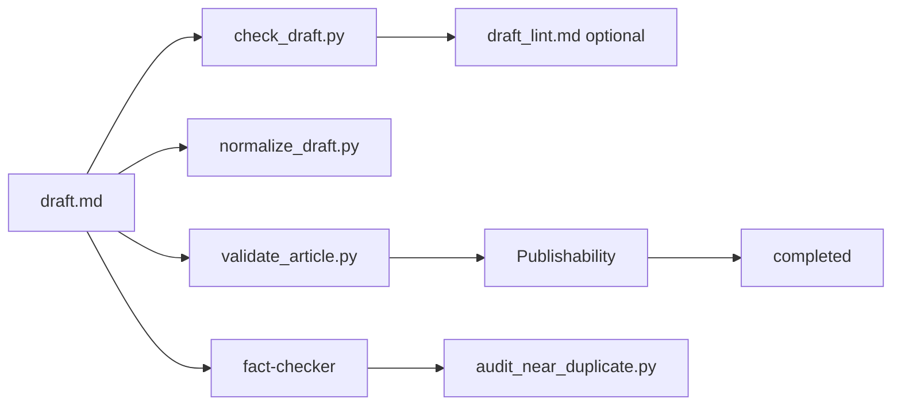

# Draft Lint 检查指引

本文说明 `check_draft.py` 的用途、何时运行、结果如何解读，以及它与工作流中其他校验步骤的关系。文末附录整合了 **2026-06-24 Tavily 调研**（search / extract / research）与行业实践对照。

## 适用场景

| 阶段 | 建议命令 | 说明 |
|------|----------|------|
| 初稿完成后 | `check_draft.py … --workspace` | 机械规则快检，不替代事实核查 |
| 编辑润色后 | 同上 + 人工扫 warns | 重点处理 AI 套话、对比句式、hedge 词 |
| 定稿前 | `--strict-final` | 额外要求 TL;DR 与 FAQ |
| 需要留痕 | `--write-report` | 在工作区生成 `draft_lint.md` |

## 快速命令

在文章工作区目录（含 `draft.md` 与 `article.json`）：

```bash
python skills/tech-blog-writer/scripts/check_draft.py content/articles/<slug> --workspace
```

仅检查单个 `draft.md`：

```bash
python skills/tech-blog-writer/scripts/check_draft.py path/to/draft.md --article-type case-study
```

定稿模式并写入报告：

```bash
python skills/tech-blog-writer/scripts/check_draft.py content/articles/<slug> --workspace --strict-final --write-report
```

通过 `bws` 运行时（若已安装 runtime）：

```bash
python scripts/blog-writing.py run --stage editorial_review --slug <slug>
```

编排层会引导 taste / fact-check；`check_draft` 仍建议作为显式机械检查单独执行。

## 结果语义

| 输出块 | 含义 | 是否阻断 |
|--------|------|----------|
| **PASSES** | 已通过的结构/长度/来源等项 | — |
| **WARNS** | 风格或软质量问题，建议修订 | 否（exit 0） |
| **ISSUES** | P0 机械问题，必须修复 | 是（exit 1） |

**PASS / FAIL** 仅由 `issues` 决定；`warns` 再多也不改变退出码。

生命周期上，`completed` 阶段还要求 `Publishability: PASS`（事实与可发布性），与本文档的机械 lint 互补，不互相替代。

## 检查项一览

### Issues（P0，必须修复）

| 标签 | 规则 |
|------|------|
| `P0-empty` | 正文为空 |
| `P0-type` | 未知 `articleType` |
| `P0-structure` | H2 数量低于该类型下限（见 `standards/article_type_profiles.md`） |
| `P0-data` | 数据信号不足（%、单位、表格、PDF/Sheet/Source 引用等启发式计数） |
| `P0-placeholder` | 残留 `[TODO]`、`[TBD]`、`[待补充]` 等 |
| `P0-units` | 混用 `°C` 与 `℃` |
| `P0-punctuation` | em-dash 密度 > 30 / 1000 词 |
| `P0-final` | `--strict-final` 下缺少 TL;DR 或 FAQ |

### Warnings（建议修订）

| 标签 | 规则 |
|------|------|
| `marketing` | 营销夸张词（revolutionary、game-changing 等） |
| `hedge` | 弱化词（very、really、just、basically、essentially 等） |
| `AI-cliche` | 中英 AI 套话；`robust` / `harness` 在技术术语语境有白名单 |
| `AI-pattern` | 对比重构句式（如 “It's not X, it's Y”） |
| `punctuation` | em-dash 密度 > 15 / 1000 词；单句多 em-dash |
| `sources` | 疑似无来源的定量表述（与 `validate_article.py` 同源逻辑） |
| `section-balance` | 单节过短（<40 词）或过长（>1200 词） |
| `structure` | 开篇段落句子数 > 3 |
| `profile` | 未命中该类型的 section 关键词或 CTA 模式 |
| `units` | `KW` / `kw` 应写作 `kW` |

### Passes

长度、H2 范围、数据信号、来源行、开篇句数、em-dash 密度等在阈值内时会记录为 `[OK] …`。

## 按 articleType 的差异

`article.json` 的 `articleType` 驱动 H2 上下限、最少数据信号、关键词与 CTA 模式。完整表格见 `standards/article_type_profiles.md`。

| 类型 | min H2 | min 数据信号 | 典型关键词 |
|------|--------|--------------|------------|
| blog | 3 | 2 | （无强制） |
| how-to | 4 | 1 | step, guide, checklist |
| case-study | 4 | 3 | challenge, solution, result |
| comparison | 4 | 3 | versus, criteria, trade |
| white-paper | 5 | 5 | methodology, finding |

## 与其他步骤的关系



| 工具 | 侧重 |
|------|------|
| `check_draft.py` | 结构、套话、标点、占位符、软来源提示 |
| `normalize_draft.py` | 标题层级、空白、可选格式统一 |
| `validate_article.py` | 工作区完整性、章节契约、可发布性评分 |
| `fact-checker` | 声明与证据、近重复审计 |
| `content-taste-advisor` | 编辑口味与叙事（非机械） |

推荐顺序：**normalize（可选）→ check_draft → validate_article → fact-check / taste**。

## 修复优先级

1. 清掉所有 **issues**（占位符、结构、单位混用、过高 em-dash）
2. 处理 **sources** 与 **P0-data**：补 `(Source: …)` / PDF / 链接，或标 `**Assumption**` / `To Verify`
3. 削减 **AI-cliche**、**AI-pattern**、**hedge**、**marketing**
4. 按 **profile** 调整章节标题与 CTA
5. 定稿前跑 `--strict-final`

## 规则来源与扩展

- 写作风格：`skills/tech-blog-writer/assets/writing_style_guide.md`（Anti-AI Rules 1–18）
- 类型配置：`skills/tech-blog-writer/scripts/_article_type_profiles.py`
- Tavily 调研原文：`.trellis-writing/research/`（见文末附录）

新增规则时：在 `_article_type_profiles.py` 增常量，在 `check_draft.py` 的 `check_draft()` 接线，并在 `skills/tech-blog-writer/scripts/tests/test_check_draft.py` 补用例。

## 已知局限

- **数据信号**与**无来源数字**均为启发式，不解析 `context_pack` 或外部语料。
- **AI 套话**为子串匹配，可能误报；`robust` / `harness` 仅部分白名单。
- **对比句式**只覆盖常见英文模板，中文变体需人工审稿。
- 未集成 Vale / language-tool；句长节奏仅检查开篇句数。
- `check_draft` 目前**不**自动写入 lifecycle gate；需在编辑流程中显式执行。

---

## 附录 A：Tavily 调研摘要（2026-06-24）

调研方法：`tvly search`（AI slop 词表、Vale 集成、无来源统计）+ `tvly extract`（Jodie Cook ban-list）+ `tvly research`（B2B 技术文机械 lint 全景）。

### A.1 核心结论

1. **单靠禁词表不够**。[Winston AI](https://gowinston.ai/most-common-chatgpt-words) 与 [Content Beta 300+ AI words](https://www.contentbeta.com/blog/list-of-words-overused-by-ai) 均指出：检测靠**句式模式 + 节奏**，而非单一词表。
2. **行业常见栈**：Python 专有检查 + [Vale](https://vale.sh/docs/styles) prose linter（[Meilisearch](https://www.meilisearch.com/blog/prose-linting-with-vale)、[Datadog](https://www.datadoghq.com/blog/engineering/how-we-use-vale-to-improve-our-documentation-editing-process)、[Spectro Cloud](https://www.spectrocloud.com/blog/how-we-use-vale-to-enforce-better-writing-in-docs-and-beyond)）。
3. **技术文可信度**：无来源统计会损害读者信任（[Noya Lizor](https://www.noyalizor.com/always-provide-proper-sources-for-statistics-in-blog-posts)）；自动化事实核查需外部证据（[Amazon Science FEVEROUS](https://www.amazon.science/blog/automated-fact-checking-using-evidence-from-tables-and-text)）。

### A.2 深度调研：五类机械检查（Tavily Research）

来源：`.trellis-writing/research/tavily-research-lint-gaps.md`

#### 1. 结构（Structure）

| 检查项 | 建议阈值 / 规则 | 严重度 | 实现方式 |
|--------|-----------------|--------|----------|
| 必需章节（Problem / Solution / CTA 等） | 可配置标题正则 | error / warn | Vale header scope 或 Python |
| 标题层级递增 | 级别跳变 ≤1 | warn | markdownlint / 预处理器 |
| 标题风格（句首大写 vs Title Case） | 每标题 ≤12 词 | warn | Vale regex |
| 段落 / 节长度 | 段 ≤6 句；节 ≤300–450 词 | warn | 外部分句 + 计数 |
| 代码块 language tag + 说明 | 围栏块缺语言或邻接说明 | warn | Markdown 解析器 |
| 图片 alt 文本 | 空 alt 或 >25 词 | warn | [Google alt 指南](https://developers.google.com/tech-writing/accessibility/self-study/write-alt-text) |
| 孤儿标题 | 标题后 <20 词即到下一标题 | warn | 块解析 |

**本项目现状**：`check_draft` 已覆盖 H2 数量、节长短、开篇句数；**未覆盖** H1 唯一性、代码块 tag、alt、孤儿标题（部分在 `validate_article.py`）。

#### 2. 引用与来源（Citations）

| 检查项 | 建议 | 严重度 | 实现方式 |
|--------|------|--------|----------|
| 断言句缺邻近引用 | “studies show”、数字断言等 | warn | 启发式 + 可选 NLP（[ALCE](https://aclanthology.org/anthology-files/pdf/emnlp/2023.emnlp-main.398.pdf)） |
| 引用密度 / 权威域名比 | 每 3 条技术断言 ≥1 引用；.gov/.edu 等 ≥25% | warn/error | 解析 `sources.jsonl` |
| 书目标注完整性 | DOI / 日期 / 作者缺失 | warn | 正则 + HEAD 请求 |
| 锚文本质量 | 避免 “click here”、<3 字符 | suggestion | Vale link token |
| 死链 | 404 / 过度重定向 | error | CI 定时 [Semonto 实践](https://semonto.com/blog/how-to-monitor-broken-links-12-seo-best-practices-2026) |

**本项目现状**：`check_draft` 有无来源数字行 **warn**；权威比、死链、claim→citation 未落地。

#### 3. 节奏 / 可读性（Rhythm）

| 检查项 | 建议阈值 | 严重度 | 实现方式 |
|--------|----------|--------|----------|
| 平均句长 + 方差 | mean ≤25 词；SD ≥6 | warn / error(>35) | 分句器 |
| 短/长句比 & 单调连续句 | >4 句长度在 ±10% 内 | warn | 滑动窗口 |
| 被动语态 | >15% | warn | regex（有误报） |
| 名词化密度 | -tion/-ment 等 >3% | suggestion | Vale substitution |
| Flesch 等级 | B2B 目标 grade 10–11 | warn | [可读性公式](https://clickhelp.com/clickhelp-technical-writing-blog/improve-the-readability-of-your-technical-documentation-with-flesch) |
| 句首重复 | 连续 >3 句同首词 | suggestion | 分句器 |

**本项目现状**：仅开篇块句数；**未覆盖** 句长均值、单调节奏、被动语态、Flesch（对应 `writing_style_guide` Rule 1–3）。

#### 4. Em-dash 与标点（Typography）

| 检查项 | 建议阈值 | 严重度 | 参考 |
|--------|----------|--------|------|
| em-dash 密度 | >15/千字 warn；>30/千字 error | warn/error | [Smashing Magazine](https://www.smashingmagazine.com/2011/08/mind-your-en-and-em-dashes-typographic-etiquette)、[AU Style Manual](https://www.stylemanual.gov.au/grammar-punctuation-and-conventions/punctuation/dashes) |
| 同句多个 em-dash | 出现即 warn | warn | regex |
| 连字符 / en-dash / em-dash 混用 | 与选定风格冲突 | warn | Vale substitution |

**本项目现状**：**已实现** 密度与同句聚类；Jodie Cook 建议技术营销文**完全不用 em-dash**（见附录 B），与 B2B 技术文惯例可二选一，当前采用密度阈值而非零容忍。

#### 5. 横切项（Cross-cutting）

- hedge 词、营销词、价值主张 / CTA 存在性
- 跑题检测、过长从句（run-on）
- **Vale 可直接做**：词表 substitution、简单被动、锚文本、破折号字符
- **需外部脚本**：分句指标、引用分析、HTTP 死链、[CiteEval](https://arxiv.org/html/2506.01829v1) 式引用质量

### A.3 Jodie Cook Ban-List 要点

来源：[jodiecook.com/ban-list](https://www.jodiecook.com/ban-list)（已 extract 至 `.trellis-writing/research/jodie-ban-list.md`）

| 类别 | 代表项 | `check_draft` 覆盖 |
|------|--------|-------------------|
| 学术腔套话 | delve, tapestry, testament, paradigm, holistic | 部分（delve、tapestry、testament 等已在 `AI_CLICHES_EN`） |
| AI 信号词 | quietly, shapes the future, compound, built different | **未覆盖**（P2 词表扩展） |
| Hedge 词 | quite, rather, essentially, basically, arguably | **已覆盖** 核心子集 |
| 对比重构句式 | It's not X it's Y; Stop X Start Y; Most people think… | **已覆盖** 6 类正则 |
| 总结套话 | In conclusion, To sum up, At the end of the day | 部分已有 |
| 虚假直接 | Let me be direct, Here's the thing | 部分已有 |
| 问句开篇 | Imagine if, What if, Have you ever wondered | **未覆盖** |
| 写作要求 | 句长多变、禁 em-dash、禁 metaphor | 仅开篇句数；em-dash 用密度阈值 |

**写作原则（摘自 ban-list，供人工审稿）**：

- 直接断言，少用 hedge
- 句长高低错落（高 burstiness）
- 跳过套路开篇/总结；sentence case 标题
- 不用文学修辞、假深刻、假对立
- 技术术语（如 robust regression、cable harness）应保留，勿机械删词

### A.4 脚本覆盖度对照

| 检测项 | `check_draft` | `writing_style_guide` | `validate_article` |
|--------|---------------|----------------------|-------------------|
| 营销词 | warn (~17) | 更长列表 | — |
| AI 套话 | warn (~40 英 + 12 中) | Rule 9–10 | — |
| 对比句式 | warn（6 模式） | Rule 10 | — |
| em-dash | warn/issue | Rule 11 | — |
| hedge 词 | warn | Rule 禁词 | — |
| 无来源数字 | warn | 要求归因 | 有 |
| 开篇句数 | warn (≤3) | Rule 6 | — |
| 句长节奏 Rule 1–3 | **无** | 有 | — |
| H1 唯一 / TL;DR / FAQ | strict-final 才查 FAQ | 有 | 有 |
| context_pack 数字交叉 | **无** | fact-check | — |
| 近重复 | 独立 `audit_near_duplicate.py` | — | — |
| lifecycle 硬门禁 | **无** | — | completed 需 PASS |

### A.5 补充路线图（P0–P3）

| 优先级 | 项 | 状态 |
|--------|-----|------|
| **P0** | 对比句式正则 | ✅ 已实现 |
| **P0** | em-dash 密度 | ✅ 已实现 |
| **P0** | hedge 禁词 | ✅ 已实现 |
| **P0** | 无来源数字扫描 | ✅ 已实现 |
| **P0** | 单位一致性（°C/℃、kW） | ✅ 已实现 |
| **P1** | 句长统计（连续相似句、短句、单句段 Rule 1–3） | ⬜ 待做 |
| **P1** | 开篇首段 ≤3 句 | ✅ 已实现 |
| **P1** | fact_checking 前默认 `--strict-final` | ⬜ 待做（workflow 文档） |
| **P2** | 引入 Vale + `.vale/styles/BlogWriting/` | ⬜ 待做 |
| **P2** | `check_draft` 作 orchestrator（Vale → Python） | ⬜ 待做 |
| **P2** | 统一 `draft_lint.md` + 可选 lifecycle 门禁 | 部分（`--write-report`） |
| **P2** | 扩展 `templates/prompts/draft.md` | 部分（已链到本指引） |
| **P3** | 死链检查（`sources.jsonl` / 正文 URL） | ⬜ 待做 |
| **P3** | draft 数字 vs `context_pack.key_claims` 交叉 | ⬜ 待做 |

### A.6 与 Casting-Workflow 的差异（避免补错方向）

| Casting 能力 | 本项目 | 是否迁移 |
|--------------|--------|----------|
| 模板词 + 结构 + 节奏硬检 | `check_draft.py` | ✅ 对齐思路 |
| 爽点密度 / 番茄标点 | — | ❌ 不迁移 |
| jieba 逗号清洗 | `normalize_draft.py`（轻量） | ❌ 不迁移 |
| 长 prompt 模板 | `templates/prompts/` | 持续扩展 |
| audit 近重复 | `audit_near_duplicate.py` | ✅ 已独立 |

Tavily 与 Winston AI 共识：**补检方向 = 句式正则 + 句长节奏 + em-dash + 来源数字**，而非无限扩词表。

### A.7 调研产物路径

| 文件 | 内容 |
|------|------|
| `.trellis-writing/research/tavily-research-lint-gaps.md` | 深度调研报告（结构/引用/节奏/破折号/Vale） |
| `.trellis-writing/research/jodie-ban-list.md` | Jodie Cook ban-list 全文 extract |
| `.trellis-writing/research/tavily-ai-slop.json` | AI slop 词表与句式检索结果 |
| `.trellis-writing/research/tavily-vale-lint.json` | Vale 技术写作 lint 实践 |
| `.trellis-writing/research/tavily-fact-lint.json` | 无来源统计 / 事实核查检索 |

### A.8 推荐阅读（规则编写时）

- [Vale 官方文档](https://vale.sh/docs/guides/regex) — regex / scope / CI 集成
- [Google 开发者文档风格](https://developers.google.com/style) — 标题与可扫描性
- [Microsoft 标题指南](https://learn.microsoft.com/en-us/style-guide/scannable-content/headings)
- [markdownlint Rules](https://github.com/DavidAnson/markdownlint/blob/main/doc/Rules.md) — 标题层级
- [Fern Docs Linting Guide](https://buildwithfern.com/post/docs-linting-guide) — 文档 lint 流水线范例

---

## 附录 B：人工审稿速查（Jodie Cook 精选禁词）

以下**尚未全部**进入 `check_draft` 自动规则，编辑润色时建议人工扫描。

**学术腔（扩词候选）**：evolving, insight, nuanced, paradigm, supercharge, facet, synergy, pivotal, underpinning, trajectory, intrigue, quintessential, relentless, ephemeral

**AI 信号短语**：quietly building, shapes the future, the work itself, hold space, decisions compound, send the signal, built different

**过渡套话**：First and foremost, In other words, To put it simply, For instance, Although / Even though / Despite（过度使用）

**问句开篇**：Imagine if, What if, Have you ever wondered, How can we

**虚假直接**：Honestly?, Here's the breakdown, Here's what nobody tells you

**完全避免**：冗长铺垫、与主题无关的伦理段落、人人适用的空话、营销黑话、假深刻/假对立、无细节的 emotionally weighted 词

完整列表见 [Jodie Cook ban-list](https://www.jodiecook.com/ban-list) 或本地 `.trellis-writing/research/jodie-ban-list.md`。
